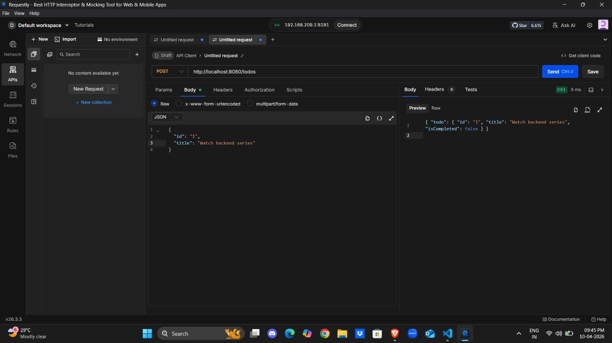
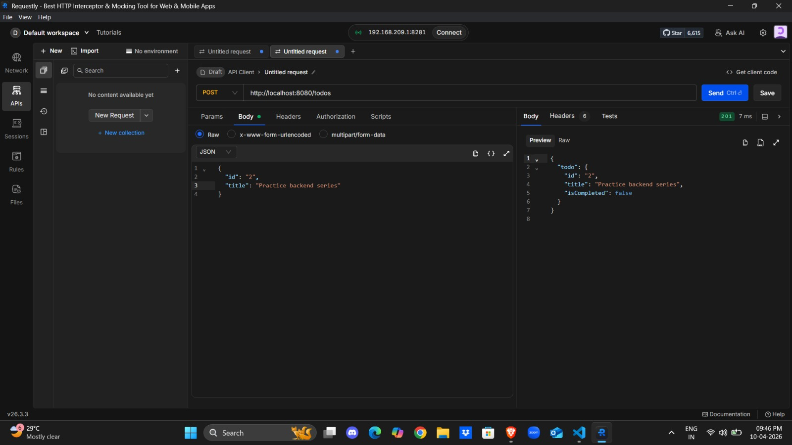
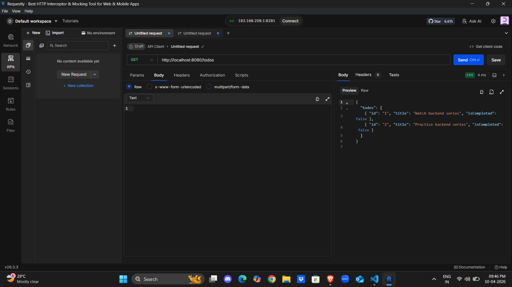

# Express + TypeScript Learning Backend (Todo API)

I built this repository while learning how to use **TypeScript with Node.js and Express** for backend development.

The goal here is not to build a complex production app. The goal is to learn strong backend foundations:
- TypeScript project setup
- Compilation from `src` to `dist`
- Development workflow with watch mode
- Why and how `.gitignore` is used
- Express with TypeScript types
- Request validation using Zod
- Clean folder structure using routes + controller + validation
- Why `.bind(this)` is needed for class-based controllers

---

## What this project demonstrates

1. **TypeScript setup basics**
- `tsconfig.json` is configured with:
  - `rootDir: ./src` (all TS source code)
  - `outDir: ./dist` (compiled JavaScript output)
- We write code in `src` and run compiled JS from `dist`.

2. **Compilation workflow**
- `tsc -p .` compiles project based on `tsconfig.json`.
- `tsc --watch` keeps recompiling when files change.
- This project uses `tsc-watch` to automatically run Node after successful compile.

3. **Why `.gitignore` matters**
- I should not push generated/build/dependency folders to GitHub:
  - `node_modules/`
  - `dist/`
  - logs/cache/env temp files
- Quick way to generate a Node template:
  - `npx gitignore node`

4. **Dependency understanding**
- Runtime deps:
  - `express`
  - `zod`
- Type/dev deps:
  - `@types/express`
  - build/watch tools
- Important learning point: tools and type packages are generally dev dependencies.

5. **Express + TypeScript architecture**
- Entry point creates HTTP server and attaches Express app.
- Express app wiring stays separate from server boot logic.
- Todo module uses route/controller split.

6. **Zod runtime validation**
- TypeScript checks types at compile time only.
- Zod validates incoming runtime data (like request body).
- This project validates todo creation payload with schema.

7. **Why `.bind(this)` is used**
- Class methods lose context when passed directly as callbacks.
- In Express routes, `controller.handleInsertTodo` without bind may lose `this`.
- `controller.handleInsertTodo.bind(controller)` ensures `this._db` works correctly.

---

## Project structure

```text
src/
  env.ts                  # runtime env validation (Zod)
  index.ts                # HTTP server bootstrap
  app/
    index.ts              # Express app creation + middleware + root routes
    to-do/
      routes.ts           # Todo routes
      controller.ts       # Todo handlers (GET/POST)
  validation/
    todo.schema.ts        # Zod schema + inferred Todo type
```

---

## API currently available

Base URL (set by `PORT`, default `8080`):
- Local: `http://127.0.0.1:8080`
- Remote/hosted: `http://<your-server-ip-or-domain>:<PORT>`

### Health / basic routes
- `GET /`
- `GET /hello`

### Todo routes
- `GET /todos`
  - Returns all todos from an in-memory array
- `POST /todos`
  - Validates request using Zod schema
  - Inserts validated todo into the in-memory array

### Example POST body

```json
{
  "id": "1",
  "title": "Learn TypeScript backend",
  "description": "Practice Express + Zod",
  "isCompleted": false
}
```

---

## Validation schema (Zod)

Todo shape used in this project:
- `id`: string
- `title`: string
- `description`: optional string
- `isCompleted`: boolean (default false)

This gives both:
- Runtime validation
- Type inference through `z.infer<typeof todoValidationSchema>`

---

## Screenshots (Requestly)

I have included these Requestly test screenshots:







They show successful GET and POST testing from Requestly.

---

## Getting started

### 1. Install dependencies

```bash
npm install
```

### 2. Run development mode

```bash
npm run dev
```

Current script:
- `dev`: `tsc-watch --onSuccess "node dist/index.js"`

### 3. Test APIs

Use Postman / Requestly / curl to test:
- `GET /todos`
- `POST /todos`

---

## What I learned in this series

- Why we create `src` and `dist`
- Why compiled JS should run from `dist`
- Why generated files should not be committed
- Difference between production dependency and dev dependency
- Why Express needs `@types/express` in TS projects
- Why runtime validation (Zod) is important even with TypeScript
- Why class route handlers often need `.bind(this)`

---

## Current limitations (intentional for learning)

- In-memory storage only (data resets on restart)
- No database integration
- Only GET and POST for todos
- No update/delete yet
- Minimal error strategy

These limitations are intentional for a foundational learning repo.

---

## Suggested next steps (optional)

If I want to keep this simple but still improve it, these are the next clean steps:

1. Return `400` for validation errors instead of generic `500`
2. Add basic `npm` scripts for build/start (`build`, `start`)
3. Add one small global error handler middleware
4. Add `.env.example` with `PORT`

Everything else can stay minimal for now.

---

## Final takeaway

This is my **starter backend learning repository**. It covers practical TypeScript + Express basics with good separation of concerns and runtime validation. It is meant as a clear reference for me and for other beginners following the same path.
